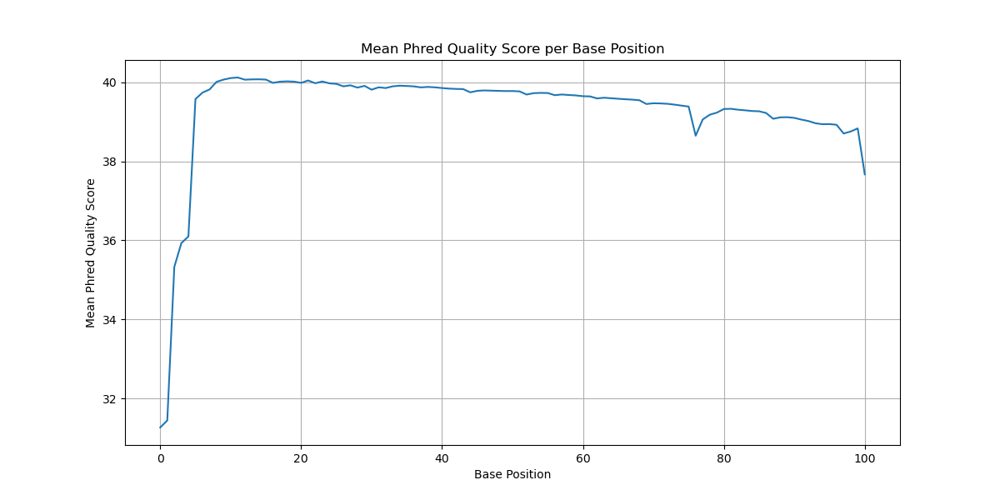
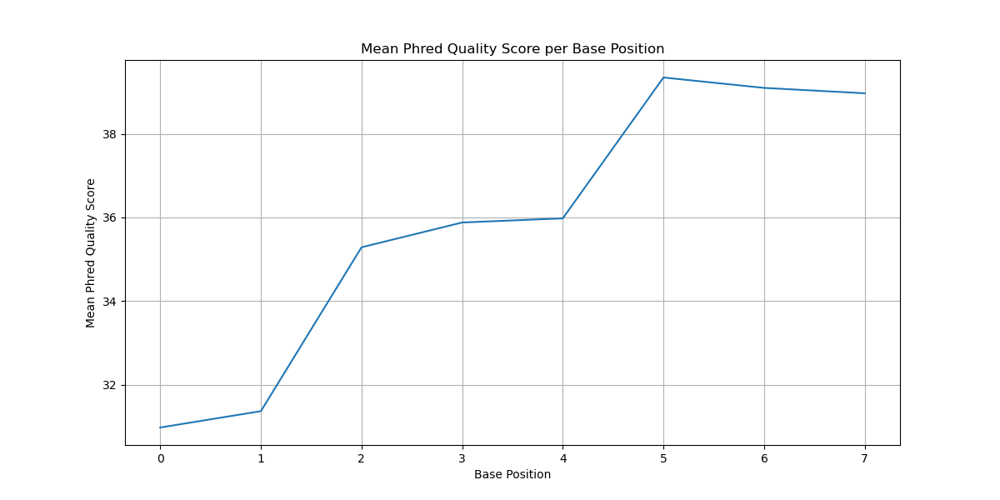
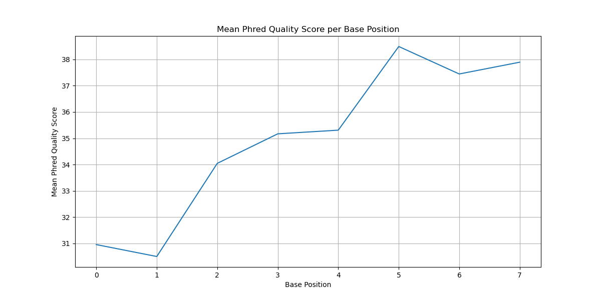
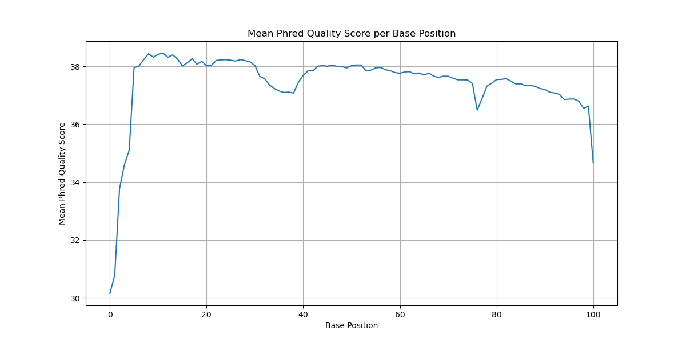

# Assignment the First

## Part 1
1. Be sure to upload your Python script. Provide a link to it here:

| File name | label | Read length | Phred encoding |
|---|---|---|---|
| 1294_S1_L008_R1_001.fastq.gz | Read 1 | 101 | Phred+33 |
| 1294_S1_L008_R2_001.fastq.gz | Index 1 | 8 | Phred+33 |
| 1294_S1_L008_R3_001.fastq.gz | Index 2 | 8 | Phred+33 |
| 1294_S1_L008_R4_001.fastq.gz | Read 2 | 101 | Phred+33 |

2. Per-base NT distribution
    1. Use markdown to insert your 4 histograms here.
### Read 1 – Mean Quality Scores


### Read 2 – Mean Quality Scores


### Read 3 – Mean Quality Scores


### Read 4 – Mean Quality Scores



2. **YOUR ANSWER HERE**
3. R2 = 3976613, R3 = 3328051, Total = 7304664 
       ```zcat 1294_S1_L008_R2_001.fastq.gz | grep -v "@" | grep "N" | wc -l```
        ```zcat 1294_S1_L008_R3_001.fastq.gz | grep -v "@" | grep "N" | wc -l```
    
## Part 2
1. Define the problem
```
Create an algorithm to demultiplex paired-end sequencing reads using two index FASTQ files and a list of 24 known index sequences. The algorithm must:

    Sort read pairs into:

        Correctly matched index-pairs (R1 + R2 FASTQ file for each unique index-pair)

        Index-hopped pairs (wrong but known index combinations)

        Reads with unknown indexes (either not in the known list or containing ambiguous bases like N, or below quality threshold)

    Annotate read headers with the index-pair used (e.g. @SEQ_ID AAAAAAAA-TTTTTTTT).

    Report statistics:

        Read-pair count per matched index-pair

        Total count of index-hopped reads

        Total count of unknown index(es)
```
2. Describe output

Inputs

    R1.fastq — forward biological reads

    R4.fastq — reverse biological reads

    R2.fastq — index1 read (forward index)

    R3.fastq — index2 read (reverse index, needs to be reverse complemented)

    known_indexes.txt — list of 24 known index sequences (8bp each, A/C/G/T only)

Outputs

    Demultiplexed FASTQ files:

        For each valid matched index-pair (24 x 24 = 576 possibilities, but only write files for pairs found), create:

            R1_index1-index2.fastq

            R2_index1-index2.fastq

        For index-hopped reads (known I1 and I2, but mismatched pair):

            R1_indexhopped.fastq, R2_indexhopped.fastq

        For unknown reads (invalid/unknown/N/low-quality indexes):

            R1_unknown.fastq, R2_unknown.fastq

    Annotated headers:

        Modify read headers in all output FASTQs to include the index pair: @SEQ_ID index1-index2

    Summary report (printed or saved as .txt):

        Count of properly matched reads per index pair

        Total index-hopped read count

        Total unknown index count

3. Upload your [4 input FASTQ files](../TEST-input_FASTQ) and your [>=6 expected output FASTQ files](../TEST-output_FASTQ).

Added!

4. Pseudocode
```
  Open the 4 input FASTQ files:

        One file for Read 1 (biological read)

        One file for Read 2 (biological read)

        One file for Index 1 (forward index)

        One file for Index 2 (reverse index)

        Also open the file containing the list of valid index sequences

    Read and store all valid indexes from the index list into memory for fast lookup.

    Initialize counters and tracking tables:

        A counter for each unique index-pair to track the number of correctly matched read pairs

        A counter to track the total number of index-hopped reads

        A table to track the number of times each index was incorrectly paired with another (i.e., index1 paired with wrong index2)

        A counter to track the number of reads with unknown or low-quality indexes

    Start reading from all four FASTQ files at the same time, record by record:

        Read one complete record from each file (4 lines per record)

    Extract the index sequences from the Index 1 and Index 2 reads:

        Reverse complement the Index 2 sequence before comparing it to the list of valid indexes

    Check if this index-pair is “unknown”:

        If either index sequence contains an invalid character (e.g., 'N')

        OR either index sequence is not found in the list of valid indexes

        OR either index has an average quality score below the required threshold

            Then:

                Mark this read pair as “unknown”

                Increment the unknown reads counter

                Skip remaining checks and proceed to step 9

    Check if this read pair is a matched pair or index-hopped:

        If the Index 1 sequence is the same as the (reverse complemented) Index 2 sequence:

            Mark the read pair as “matched”

            Increment the matched read count for that specific index-pair

        Else:

            Mark the read pair as “index-hopped”

            Increment the index-hopped counter

            Increment the count for that specific mismatched index-pair (index1 combined with index2)

    Prepare the read pair for writing:

        Modify the header line of both Read 1 and Read 2 to include the index-pair used (e.g., append index1-index2)

    Write the read pair to the appropriate output files:

        If the read was marked as matched:

            Write the Read 1 and Read 2 records to a unique file named after the index-pair

        If the read was marked as index-hopped:

            Write the Read 1 and Read 2 records to a general “index-hopped” file

        If the read was marked as unknown:

            Write the Read 1 and Read 2 records to a general “unknown” file

    Repeat until the end of all four input files is reached

    After all records have been processed, generate a summary report:

    For each correctly matched index-pair:

        Print or save the total number of reads assigned to it

    Print or save the total number of index-hopped reads

    Print or save how many times each mismatched index-pair occurred (e.g., how many times A was paired with B and vice versa)

    Print or save the total number of unknown reads
```


5. High level functions. For each function, be sure to include:
    1. Description/doc string
    2. Function headers (name and parameters)
    3. Test examples for individual functions
    4. Return statement


```python
def reverse_complement(seq: str) -> str:
    '''Takes a DNA sequence string and returns its reverse complement.'''
    return rev_comp
```

- **Input:** `"ATCG"`  
- **Expected output:** `"CGAT"`

---


```python
def convert_phred(letter: str) -> int:
    '''Takes a single ASCII character (string) encoded in Phred+33 and
    returns the quality score value as an integer.'''
    return qscore
```

- **Input:** `"I"`  
- **Expected output:** `40`

---


```python
def is_valid_index(index: str, known_indexes: list) -> bool:
    '''Checks whether the given index string is in the known index list
    and contains only valid nucleotides (A/C/G/T).'''
    return validity
```

- **Input:** `"ACGTACGT"`, `known_indexes = ["ACGTACGT", "TTTTTTTT"]`  
- **Expected output:** `True`

---


```python
def check_quality(qual: str, cutoff: int) -> bool:
    '''Evaluates whether all base quality scores in the quality string
    are above a given cutoff.'''
    return is_above_cutoff
```

- **Input:** `"IIIIIIII"`, `cutoff = 30`  
- **Expected output:** `True`

---


```python
def annotate_header(header: str, index1: str, index2: str) -> str:
    '''Appends the index1-index2 pair to the read header string.'''
    return annotated_header
```

- **Input:** `"@SEQ_ID"`, `index1 = "AAAAAAAT"`, `index2 = "TTTTTTTT"`  
- **Expected output:** `"@SEQ_ID AAAAAAAT-TTTTTTTT"`

---


```python
def categorize_read(index1: str, index2: str, known_indexes: list, qual1: str, qual2: str, cutoff: int) -> str:
    '''Determines whether a read is "matched", "hopped", or "unknown"
    based on index validity, matching, and quality.'''
    return category
```

- **Input:**  
  `index1 = "AAAAAAAT"`, `index2 = "AAAAAAAT"`  
  `known_indexes = [...]`, `qual1 = "IIIIIIII"`, `qual2 = "IIIIIIII"`, `cutoff = 30`  
- **Expected output:** `"matched"`

---


```python
def write_record(output_files: dict, category: str, index_pair: str, r1_lines: list, r2_lines: list) -> None:
    '''Writes the annotated read pair to the appropriate output file based on its category.'''
    return None
```

- **Input:**  
  `category = "matched"`, `index_pair = "AAAAAAAT-TTTTTTTT"`  
  `r1_lines = [...]`, `r2_lines = [...]`  
- **Expected output:**  
  Records written to `R1_AAAAAAAT-TTTTTTTT.fastq` and `R2_AAAAAAAT-TTTTTTTT.fastq`

---


```python
def update_counters(category: str, index1: str, index2: str, counters: dict) -> None:
    '''Increments the appropriate counters depending on whether the read is matched, hopped, or unknown.'''
    return None
```

- **Input:**  
  `category = "hopped"`, `index1 = "AAAAAAAT"`, `index2 = "CCCCCCCC"`, `counters = {...}`  
- **Expected output:**  
  `hopped count += 1`  
  `hopped["AAAAAAAT"]["CCCCCCCC"] += 1`
